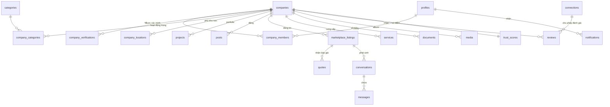

# TÀI LIỆU THIẾT KẾ KỸ THUẬT — SanXayDung.vn

> Nền tảng B2B kết nối hệ sinh thái doanh nghiệp xây dựng, xây trên **Supabase**.
> Tài liệu này bám theo [Đề án dự án](./de-an-san-xay-dung.md) và cụ thể hóa kiến trúc, dữ liệu, bảo mật cho phạm vi **MVP+**.

| | |
|---|---|
| **Phiên bản** | 0.1 (draft) |
| **Phạm vi** | MVP+ (GĐ1 của đề án + lớp tin cậy tối thiểu) |
| **Backend** | Supabase (Postgres 15, Auth, Storage, Realtime, Edge Functions) |
| **Tài liệu liên quan** | [Đề án](./de-an-san-xay-dung.md) |

---

## Mục lục

1. [Mục tiêu & phạm vi](#1-mục-tiêu--phạm-vi)
2. [Tech stack & lý do chọn Supabase](#2-tech-stack--lý-do-chọn-supabase)
3. [Kiến trúc tổng quan](#3-kiến-trúc-tổng-quan)
4. [Xác thực & mô hình đa doanh nghiệp](#4-xác-thực--mô-hình-đa-doanh-nghiệp-multi-tenant)
5. [Thiết kế cơ sở dữ liệu](#5-thiết-kế-cơ-sở-dữ-liệu)
6. [Row Level Security (RLS)](#6-row-level-security-rls)
7. [Supabase Storage](#7-supabase-storage)
8. [Realtime](#8-realtime)
9. [Tìm kiếm tiếng Việt (Full-Text Search)](#9-tìm-kiếm-tiếng-việt-full-text-search)
10. [Trust Score Engine](#10-trust-score-engine)
11. [Edge Functions & tích hợp ngoài](#11-edge-functions--tích-hợp-ngoài)
12. [Tác vụ nền (pg_cron)](#12-tác-vụ-nền-pg_cron)
13. [API](#13-api)
14. [Bảo mật, quyền riêng tư & tuân thủ](#14-bảo-mật-quyền-riêng-tư--tuân-thủ)
15. [Hiệu năng & mở rộng](#15-hiệu-năng--mở-rộng)
16. [Môi trường, migration & CI/CD](#16-môi-trường-migration--cicd)
17. [Phân rã theo giai đoạn](#17-phân-rã-theo-giai-đoạn)
18. [Vấn đề mở & rủi ro kỹ thuật](#18-vấn-đề-mở--rủi-ro-kỹ-thuật)

---

## 1. Mục tiêu & phạm vi

**Mục tiêu kỹ thuật MVP+:** dựng nền tảng đủ để kiểm chứng nhu cầu, đồng thời có sẵn *lớp tin cậy tối thiểu* (xác minh + review xác thực + gói Verified) để tạo niềm tin và doanh thu sớm.

**Trong phạm vi (In-scope):**
- Đăng ký / đăng nhập, hồ sơ cá nhân, quản lý thành viên doanh nghiệp
- **Company Profile** (trung tâm) + portfolio (dự án, album, tài liệu, dịch vụ, thiết bị, nhân sự)
- **News Feed**, **Marketplace** (tin đăng nhu cầu), **Chat**
- **Review** đa tiêu chí (chỉ từ kết nối xác thực)
- **Trust Score** (bản cơ bản, có breakdown)
- **Xác minh** doanh nghiệp (MST/GPKD) + huy hiệu
- **Tìm kiếm** doanh nghiệp/tin đăng, thông báo, gói thành viên

**Ngoài phạm vi MVP+ (để GĐ2–3):** đấu thầu online, AI Matching nâng cao, escrow/hợp đồng điện tử, CRM/quản lý dự án sâu, app mobile, SaaS. Schema vẫn chừa chỗ mở rộng.

---

## 2. Tech stack & lý do chọn Supabase

| Lớp | Công nghệ | Ghi chú |
|-----|-----------|---------|
| CSDL | **Postgres 15** (Supabase) | quan hệ mạnh, JSONB, FTS, `pg_cron`, `pg_trgm`, `unaccent`, PostGIS (tùy chọn) |
| API | **PostgREST** (tự sinh) + **RPC** (SQL functions) | REST tự động từ schema; logic phức tạp qua function |
| Auth | **Supabase Auth** (GoTrue) | email + **OTP điện thoại** (phổ biến ở VN), OAuth (Google/Zalo) |
| Lưu trữ | **Supabase Storage** (S3-compatible) | logo, ảnh, video, tài liệu; policy theo RLS |
| Realtime | **Supabase Realtime** | chat, thông báo, presence |
| Serverless | **Edge Functions** (Deno) | xác minh, gửi Zalo/Email, webhook thanh toán, sitemap |
| Bảo mật dữ liệu | **RLS** (Row Level Security) | cách ly đa doanh nghiệp ngay ở tầng DB |
| Frontend | Next.js (đề xuất) | SSR cho SEO Company Page; dùng `@supabase/supabase-js` |

**Vì sao Supabase phù hợp dự án này:**
- **RLS ở tầng DB** giải quyết bài toán đa doanh nghiệp (mỗi Company là một "tenant") một cách nhất quán, khó rò rỉ dữ liệu — kể cả khi có nhiều client.
- **Postgres FTS + `unaccent`** xử lý tốt tìm kiếm tiếng Việt không dấu mà không cần dịch vụ search riêng ở giai đoạn đầu.
- Có sẵn Auth/Storage/Realtime → giảm mạnh thời gian tới MVP.
- Chuẩn Postgres → không khóa nhà cung cấp; sau này tách service/thêm read-replica dễ dàng.

---

## 3. Kiến trúc tổng quan

```
        ┌─────────────────────────────────────────────┐
        │  Client (Next.js SSR/CSR, Web + App sau này) │
        └───────────────┬─────────────────────────────┘
                        │ supabase-js (JWT)
        ┌───────────────▼─────────────────────────────┐
        │                 SUPABASE                     │
        │  ┌────────────┐  ┌───────────┐ ┌───────────┐ │
        │  │ Auth       │  │ Storage   │ │ Realtime  │ │
        │  │ (GoTrue)   │  │ (S3)      │ │ (chat/noti)│ │
        │  └────────────┘  └───────────┘ └───────────┘ │
        │  ┌──────────────────────────────────────────┐│
        │  │ PostgREST  ── REST/RPC ──► Postgres + RLS ││
        │  └──────────────────────────────────────────┘│
        │  ┌────────────┐   pg_cron (nền)               │
        │  │ Edge Funcs │◄──────────────┐               │
        │  └─────┬──────┘                                │
        └────────┼──────────────────────────────────────┘
                 │  gọi ra ngoài
     ┌───────────┼───────────────┬──────────────┐
     ▼           ▼               ▼              ▼
  API tra cứu  Zalo OA /      Cổng thanh      Email
  MST/GPKD     Email          toán (GĐ3)      (Resend/SES)
```

**Nguyên tắc:**
- Client **không bao giờ** dùng `service_role` key — chỉ `anon`/user JWT; mọi quyền do RLS quyết định.
- Tác vụ đặc quyền (xác minh, tính Trust Score, gửi thông báo, webhook) chạy trong **Edge Functions** với `service_role`.
- Logic nghiệp vụ ưu tiên đặt trong **Postgres function** (RPC) để đảm bảo tính nhất quán và tận dụng RLS.

---

## 4. Xác thực & mô hình đa doanh nghiệp (multi-tenant)

**Nguyên tắc cốt lõi:** *User* (cá nhân) và *Company* (doanh nghiệp) tách biệt. Một user có thể thuộc **nhiều** company; một company có **nhiều** thành viên với **vai trò** khác nhau. Mọi hành động ghi dữ liệu company đều kiểm tra tư cách thành viên.

**Vai trò trong doanh nghiệp** (`company_members.role`):

| Role | Quyền |
|------|-------|
| `owner` | toàn quyền, xóa company, quản lý billing & thành viên |
| `admin` | quản lý nội dung, tin đăng, thành viên (trừ owner) |
| `editor` | tạo/sửa bài viết, tin đăng, dự án |
| `member` | xem nội bộ, chat thay mặt công ty |

**Luồng onboarding:**
1. User đăng ký (email hoặc OTP điện thoại) → tạo bản ghi `profiles`.
2. User **tạo mới** company (trở thành `owner`) **hoặc claim** một company đã được seed sẵn (xác minh quyền sở hữu qua MST/email tên miền).
3. Mời thành viên qua email → tạo `company_invitations` → khi chấp nhận sinh `company_members`.

**JWT & context:** claim mặc định của Supabase là `auth.uid()`. Không nhồi danh sách company vào JWT (dễ lỗi thời) — thay vào đó kiểm tra tư cách thành viên trực tiếp trong RLS bằng hàm `is_company_member()` (mục 6).

---

## 5. Thiết kế cơ sở dữ liệu

### 5.1 Sơ đồ quan hệ (rút gọn)



### 5.2 Quy ước chung

- Khóa chính: `id uuid default gen_random_uuid()`.
- Mốc thời gian: `created_at timestamptz default now()`, `updated_at` cập nhật qua trigger.
- Xóa mềm: `deleted_at timestamptz` cho các bảng nội dung.
- Enum dùng `text` + `check` (dễ migrate hơn `enum` type) hoặc bảng tra cứu.
- Trigger `set_updated_at` áp cho mọi bảng có `updated_at`.

```sql
create extension if not exists pg_trgm;
create extension if not exists unaccent;
create extension if not exists pg_cron;

create or replace function public.set_updated_at()
returns trigger language plpgsql as $$
begin new.updated_at = now(); return new; end $$;
```

### 5.3 Người dùng & doanh nghiệp

```sql
-- Hồ sơ cá nhân, 1-1 với auth.users
create table public.profiles (
  id          uuid primary key references auth.users(id) on delete cascade,
  full_name   text,
  avatar_url  text,
  phone       text,
  created_at  timestamptz default now(),
  updated_at  timestamptz default now()
);

-- Doanh nghiệp — THỰC THỂ TRUNG TÂM
create table public.companies (
  id            uuid primary key default gen_random_uuid(),
  slug          text unique not null,          -- dùng cho URL/SEO: /cong-ty/hoa-binh
  name          text not null,
  tax_code      text,                          -- MST
  legal_name    text,
  logo_url      text,
  cover_url     text,
  intro         text,                          -- giới thiệu
  description   text,
  website       text,
  email         text,
  phone         text,
  address       text,
  province_code text,                          -- trụ sở
  founded_year  int,
  size_range    text,                          -- '1-10','11-50',...
  status        text not null default 'draft'  -- draft|published|suspended
                check (status in ('draft','published','suspended')),
  verified_tier text not null default 'none'   -- none|legal|capability|gold
                check (verified_tier in ('none','legal','capability','gold')),
  trust_score   numeric(5,2) default 0,        -- bản sao để sort nhanh (nguồn: trust_scores)
  profile_completeness int default 0,          -- % hoàn thiện hồ sơ
  owner_id      uuid references public.profiles(id),
  search_tsv    tsvector,                       -- xem mục 9
  created_at    timestamptz default now(),
  updated_at    timestamptz default now(),
  deleted_at    timestamptz
);
create index on public.companies (status) where deleted_at is null;
create index on public.companies (verified_tier);
create index on public.companies (trust_score desc);
create index companies_search_idx on public.companies using gin (search_tsv);

-- Thành viên doanh nghiệp (n-n user↔company + vai trò)
create table public.company_members (
  id          uuid primary key default gen_random_uuid(),
  company_id  uuid not null references public.companies(id) on delete cascade,
  user_id     uuid not null references public.profiles(id) on delete cascade,
  role        text not null default 'member'
              check (role in ('owner','admin','editor','member')),
  status      text not null default 'active'
              check (status in ('active','invited','removed')),
  created_at  timestamptz default now(),
  unique (company_id, user_id)
);
create index on public.company_members (user_id);
create index on public.company_members (company_id);

-- Lời mời thành viên
create table public.company_invitations (
  id          uuid primary key default gen_random_uuid(),
  company_id  uuid not null references public.companies(id) on delete cascade,
  email       text not null,
  role        text not null default 'member',
  token       text not null unique,
  invited_by  uuid references public.profiles(id),
  expires_at  timestamptz not null,
  accepted_at timestamptz,
  created_at  timestamptz default now()
);
```

### 5.4 Xác minh & huy hiệu

```sql
create table public.company_verifications (
  id           uuid primary key default gen_random_uuid(),
  company_id   uuid not null references public.companies(id) on delete cascade,
  kind         text not null                      -- tax|business_license|capability_cert
               check (kind in ('tax','business_license','capability_cert')),
  status       text not null default 'pending'    -- pending|verified|rejected
               check (status in ('pending','verified','rejected')),
  reference    text,                              -- MST / số GPKD / số chứng chỉ
  cert_class   text,                              -- hạng I/II/III (chứng chỉ năng lực)
  evidence_url text,                              -- file bằng chứng (bucket private)
  meta         jsonb default '{}',                -- dữ liệu trả về từ API tra cứu
  verified_by  uuid references public.profiles(id),
  verified_at  timestamptz,
  created_at   timestamptz default now()
);
create index on public.company_verifications (company_id, kind);
```

> `companies.verified_tier` được nâng cấp bởi Edge Function/trigger khi có bản ghi `verified`: có `tax`/`business_license` → `legal`; thêm `capability_cert` → `capability`; đạt tiêu chí vàng (điểm + số dự án + đánh giá) → `gold`.

### 5.5 Danh mục & địa lý

```sql
-- Taxonomy lĩnh vực: nhà thầu / đội thi công / nhà cung cấp / dịch vụ (có cấp cha-con)
create table public.categories (
  id         uuid primary key default gen_random_uuid(),
  parent_id  uuid references public.categories(id),
  group_key  text not null,     -- contractor|crew|supplier|service
  slug       text unique not null,
  name       text not null,
  sort_order int default 0
);

create table public.company_categories (
  company_id  uuid references public.companies(id) on delete cascade,
  category_id uuid references public.categories(id) on delete cascade,
  primary key (company_id, category_id)
);

-- Tỉnh/thành (chuẩn hóa để lọc khu vực)
create table public.provinces (
  code text primary key,        -- theo mã hành chính
  name text not null
);
create table public.company_locations (
  company_id    uuid references public.companies(id) on delete cascade,
  province_code text references public.provinces(code),
  primary key (company_id, province_code)
);
```

### 5.6 Portfolio (dự án, media, tài liệu, dịch vụ, thiết bị, nhân sự)

```sql
create table public.projects (
  id           uuid primary key default gen_random_uuid(),
  company_id   uuid not null references public.companies(id) on delete cascade,
  title        text not null,
  role         text,                       -- vai trò: tổng thầu/thầu phụ...
  category_id  uuid references public.categories(id),
  province_code text,
  scale        text,                        -- quy mô / giá trị
  year         int,
  cover_url    text,
  description  text,
  status       text default 'completed'
               check (status in ('ongoing','completed')),
  created_at   timestamptz default now(),
  updated_at   timestamptz default now()
);

-- Album ảnh/video dùng chung (đa hình thức)
create table public.media (
  id          uuid primary key default gen_random_uuid(),
  company_id  uuid not null references public.companies(id) on delete cascade,
  owner_type  text not null,                -- company|project|post
  owner_id    uuid not null,
  kind        text not null check (kind in ('image','video')),
  url         text not null,
  caption     text,
  sort_order  int default 0,
  created_at  timestamptz default now()
);
create index on public.media (owner_type, owner_id);

-- Tài liệu (hồ sơ năng lực) — có mức riêng tư
create table public.documents (
  id          uuid primary key default gen_random_uuid(),
  company_id  uuid not null references public.companies(id) on delete cascade,
  title       text not null,
  file_url    text not null,                -- bucket private company-documents
  visibility  text not null default 'members'
              check (visibility in ('public','members','connections')),
  size_bytes  bigint,
  created_at  timestamptz default now()
);

create table public.services (
  id          uuid primary key default gen_random_uuid(),
  company_id  uuid not null references public.companies(id) on delete cascade,
  name        text not null,
  category_id uuid references public.categories(id),
  description text,
  price_from  numeric, price_to numeric, price_unit text,
  created_at  timestamptz default now()
);

create table public.equipment (
  id uuid primary key default gen_random_uuid(),
  company_id uuid not null references public.companies(id) on delete cascade,
  name text not null, quantity int, note text
);

create table public.staff (
  id uuid primary key default gen_random_uuid(),
  company_id uuid not null references public.companies(id) on delete cascade,
  full_name text, title text, experience_years int, avatar_url text
);
```

### 5.7 News Feed

```sql
create table public.posts (
  id          uuid primary key default gen_random_uuid(),
  company_id  uuid not null references public.companies(id) on delete cascade,
  author_id   uuid references public.profiles(id),
  type        text not null default 'news'
              check (type in ('news','new_project','completed_project',
                              'recruitment','equipment','certificate','promotion','activity')),
  title       text,
  body        text,
  status      text not null default 'published'
              check (status in ('draft','published','hidden')),
  like_count  int default 0,
  comment_count int default 0,
  search_tsv  tsvector,
  created_at  timestamptz default now(),
  updated_at  timestamptz default now(),
  deleted_at  timestamptz
);
create index on public.posts (company_id, created_at desc);
create index posts_search_idx on public.posts using gin (search_tsv);

-- Tương tác nhẹ (đề án hướng B2B, không phải MXH cá nhân → giữ tối giản)
create table public.post_reactions (
  post_id uuid references public.posts(id) on delete cascade,
  user_id uuid references public.profiles(id) on delete cascade,
  created_at timestamptz default now(),
  primary key (post_id, user_id)
);
```

### 5.8 Marketplace, RFQ & báo giá

```sql
create table public.marketplace_listings (
  id           uuid primary key default gen_random_uuid(),
  company_id   uuid not null references public.companies(id) on delete cascade,
  author_id    uuid references public.profiles(id),
  type         text not null                -- need_contractor|need_crew|need_supplier|partnership|offer_service|opportunity
               check (type in ('need_contractor','need_crew','need_supplier',
                               'partnership','offer_service','opportunity')),
  title        text not null,
  description  text,
  category_id  uuid references public.categories(id),
  province_code text,
  budget_from  numeric, budget_to numeric,
  deadline     date,
  status       text not null default 'open'
               check (status in ('open','closed','fulfilled','expired')),
  is_featured  boolean default false,       -- gói ưu tiên (doanh thu)
  quote_count  int default 0,
  search_tsv   tsvector,
  created_at   timestamptz default now(),
  updated_at   timestamptz default now(),
  deleted_at   timestamptz
);
create index on public.marketplace_listings (type, status, created_at desc);
create index listings_search_idx on public.marketplace_listings using gin (search_tsv);

-- Báo giá phản hồi cho một tin (nền cho RFQ / đấu thầu sau này)
create table public.quotes (
  id           uuid primary key default gen_random_uuid(),
  listing_id   uuid not null references public.marketplace_listings(id) on delete cascade,
  company_id   uuid not null references public.companies(id) on delete cascade, -- bên báo giá
  amount       numeric,
  currency     text default 'VND',
  message      text,
  attachment_url text,
  status       text not null default 'sent'
               check (status in ('sent','shortlisted','accepted','rejected','withdrawn')),
  created_at   timestamptz default now(),
  unique (listing_id, company_id)
);
```

### 5.9 Chat (Realtime)

```sql
create table public.conversations (
  id          uuid primary key default gen_random_uuid(),
  context_type text,                        -- listing|project|company (gắn ngữ cảnh)
  context_id  uuid,
  created_by  uuid references public.profiles(id),
  last_message_at timestamptz,
  created_at  timestamptz default now()
);

-- Người tham gia hội thoại LÀ doanh nghiệp (đại diện bởi user)
create table public.conversation_participants (
  conversation_id uuid references public.conversations(id) on delete cascade,
  company_id      uuid references public.companies(id) on delete cascade,
  primary key (conversation_id, company_id)
);

create table public.messages (
  id              uuid primary key default gen_random_uuid(),
  conversation_id uuid not null references public.conversations(id) on delete cascade,
  sender_company_id uuid references public.companies(id),
  sender_user_id  uuid references public.profiles(id),
  body            text,
  kind            text default 'text'       -- text|quote|file|system
                  check (kind in ('text','quote','file','system')),
  attachment_url  text,
  meta            jsonb default '{}',        -- vd báo giá: {amount, currency}
  read_by         uuid[] default '{}',
  created_at      timestamptz default now()
);
create index on public.messages (conversation_id, created_at);
```

### 5.10 Kết nối, đánh giá & Trust Score

```sql
-- "Lượt kết nối thành công" — gốc cho review xác thực & KPI
create table public.connections (
  id            uuid primary key default gen_random_uuid(),
  requester_company_id uuid not null references public.companies(id) on delete cascade,
  target_company_id    uuid not null references public.companies(id) on delete cascade,
  listing_id    uuid references public.marketplace_listings(id),
  status        text not null default 'pending'
                check (status in ('pending','accepted','completed','cancelled')),
  created_at    timestamptz default now(),
  completed_at  timestamptz
);

-- Đánh giá đa tiêu chí — CHỈ từ connection đã 'completed'
create table public.reviews (
  id            uuid primary key default gen_random_uuid(),
  connection_id uuid not null references public.connections(id),      -- ràng buộc xác thực
  reviewer_company_id uuid not null references public.companies(id),
  target_company_id   uuid not null references public.companies(id) on delete cascade,
  score_quality      int check (score_quality between 1 and 5),
  score_progress     int check (score_progress between 1 and 5),
  score_cost         int check (score_cost between 1 and 5),
  score_cooperation  int check (score_cooperation between 1 and 5),
  score_safety       int check (score_safety between 1 and 5),
  score_warranty     int check (score_warranty between 1 and 5),
  overall            numeric(3,2),          -- trung bình các tiêu chí (trigger tính)
  comment            text,
  status             text default 'published'
                     check (status in ('published','hidden','flagged')),
  created_at         timestamptz default now(),
  unique (connection_id, reviewer_company_id)  -- mỗi kết nối, mỗi bên đánh giá 1 lần
);
create index on public.reviews (target_company_id, status);

-- Điểm uy tín (1-1 với company) + breakdown minh bạch
create table public.trust_scores (
  company_id  uuid primary key references public.companies(id) on delete cascade,
  score       numeric(5,2) not null default 0,   -- 0..100
  breakdown   jsonb not null default '{}',        -- {verification:20, reviews:35, ...}
  computed_at timestamptz default now()
);

-- Lịch sử thay đổi điểm (giải trình + biểu đồ)
create table public.trust_score_history (
  id uuid primary key default gen_random_uuid(),
  company_id uuid references public.companies(id) on delete cascade,
  score numeric(5,2),
  breakdown jsonb,
  created_at timestamptz default now()
);
```

### 5.11 Thông báo, gói dịch vụ, quảng cáo

```sql
create table public.notifications (
  id         uuid primary key default gen_random_uuid(),
  user_id    uuid not null references public.profiles(id) on delete cascade,
  company_id uuid references public.companies(id),
  type       text not null,                  -- new_message|new_quote|review_received|verify_result|...
  title      text, body text, link text,
  data       jsonb default '{}',
  is_read    boolean default false,
  created_at timestamptz default now()
);
create index on public.notifications (user_id, is_read, created_at desc);

create table public.notification_prefs (
  user_id uuid primary key references public.profiles(id) on delete cascade,
  email   boolean default true,
  zalo    boolean default true,
  push    boolean default true,
  digest  text default 'instant'            -- instant|daily|off
);

-- Gói thành viên & thuê bao
create table public.plans (
  id text primary key,                        -- free|professional|enterprise
  name text, price_month numeric, features jsonb
);
create table public.subscriptions (
  id          uuid primary key default gen_random_uuid(),
  company_id  uuid not null references public.companies(id) on delete cascade,
  plan_id     text references public.plans(id),
  status      text default 'active'          -- active|past_due|cancelled
              check (status in ('active','past_due','cancelled')),
  started_at  timestamptz default now(),
  expires_at  timestamptz
);

-- Quảng cáo / gian hàng tài trợ
create table public.ad_placements (
  id uuid primary key default gen_random_uuid(),
  company_id uuid references public.companies(id) on delete cascade,
  slot text,                                  -- home_banner|listing_top|featured_post
  creative_url text, target_url text,
  starts_at timestamptz, ends_at timestamptz,
  status text default 'active'
);
```

### 5.12 Kiểm toán & kiểm duyệt

```sql
create table public.audit_log (
  id uuid primary key default gen_random_uuid(),
  actor_id uuid references public.profiles(id),
  company_id uuid,
  action text not null,                       -- vd company.update, verification.approve
  entity_type text, entity_id uuid,
  diff jsonb,
  ip inet, created_at timestamptz default now()
);

create table public.reports (           -- báo cáo nội dung vi phạm
  id uuid primary key default gen_random_uuid(),
  reporter_id uuid references public.profiles(id),
  entity_type text, entity_id uuid,
  reason text, status text default 'open'
             check (status in ('open','reviewing','resolved','dismissed')),
  created_at timestamptz default now()
);
```

---

## 6. Row Level Security (RLS)

**Bật RLS trên MỌI bảng.** Mặc định từ chối; cấp quyền bằng policy tường minh. Hai hàm trợ giúp trung tâm:

```sql
-- Kiểm tra user hiện tại có phải thành viên active của company (tùy chọn min role)
create or replace function public.is_company_member(_company_id uuid, _min_role text default 'member')
returns boolean language sql stable security definer set search_path = public as $$
  select exists (
    select 1 from public.company_members cm
    where cm.company_id = _company_id
      and cm.user_id = auth.uid()
      and cm.status = 'active'
      and (
        _min_role = 'member'
        or (_min_role = 'editor' and cm.role in ('owner','admin','editor'))
        or (_min_role = 'admin'  and cm.role in ('owner','admin'))
        or (_min_role = 'owner'  and cm.role = 'owner')
      )
  );
$$;

-- Hai company có kết nối đã hoàn tất? (để mở tài liệu 'connections')
create or replace function public.has_connection(_a uuid, _b uuid)
returns boolean language sql stable security definer set search_path = public as $$
  select exists (
    select 1 from public.connections c
    where c.status = 'completed'
      and ((c.requester_company_id=_a and c.target_company_id=_b)
        or (c.requester_company_id=_b and c.target_company_id=_a))
  );
$$;
```

**Ví dụ policy tiêu biểu:**

```sql
-- COMPANIES: ai cũng đọc company đã publish; chỉ thành viên (>=editor) được sửa
alter table public.companies enable row level security;

create policy companies_read_public on public.companies
  for select using (status = 'published' and deleted_at is null
                    or is_company_member(id));      -- thành viên xem cả bản nháp

create policy companies_insert_self on public.companies
  for insert with check (owner_id = auth.uid());

create policy companies_update_member on public.companies
  for update using (is_company_member(id,'editor'))
              with check (is_company_member(id,'editor'));

-- COMPANY_MEMBERS: xem thành viên công ty của mình; chỉ admin+ thêm/bớt
alter table public.company_members enable row level security;
create policy cm_read on public.company_members
  for select using (is_company_member(company_id));
create policy cm_write on public.company_members
  for all using (is_company_member(company_id,'admin'))
          with check (is_company_member(company_id,'admin'));

-- POSTS: đọc bài published; ghi bởi editor+ của công ty
alter table public.posts enable row level security;
create policy posts_read on public.posts
  for select using (status='published' and deleted_at is null
                    or is_company_member(company_id));
create policy posts_write on public.posts
  for all using (is_company_member(company_id,'editor'))
          with check (is_company_member(company_id,'editor'));

-- MARKETPLACE: đọc tin open công khai; ghi bởi editor+
alter table public.marketplace_listings enable row level security;
create policy ml_read on public.marketplace_listings
  for select using (status='open' and deleted_at is null
                    or is_company_member(company_id));
create policy ml_write on public.marketplace_listings
  for all using (is_company_member(company_id,'editor'))
          with check (is_company_member(company_id,'editor'));

-- MESSAGES: chỉ thành viên của công ty đang tham gia hội thoại
alter table public.messages enable row level security;
create policy msg_read on public.messages
  for select using (exists (
    select 1 from public.conversation_participants p
    where p.conversation_id = messages.conversation_id
      and is_company_member(p.company_id)));
create policy msg_send on public.messages
  for insert with check (
    is_company_member(sender_company_id)
    and exists (select 1 from public.conversation_participants p
                where p.conversation_id = messages.conversation_id
                  and p.company_id = sender_company_id));

-- DOCUMENTS: theo visibility
alter table public.documents enable row level security;
create policy docs_read on public.documents for select using (
  visibility='public'
  or (visibility='members' and is_company_member(company_id))
  or (visibility='connections' and (is_company_member(company_id)
        or has_connection(company_id, /* company của người xem */ null) ))  -- tinh chỉnh theo context
);

-- REVIEWS: đọc công khai bản published; chỉ tạo được nếu có connection completed
alter table public.reviews enable row level security;
create policy rv_read on public.reviews for select using (status='published');
create policy rv_write on public.reviews for insert with check (
  is_company_member(reviewer_company_id,'admin')
  and exists (select 1 from public.connections c
              where c.id = connection_id and c.status='completed'
                and (c.requester_company_id=reviewer_company_id
                     or c.target_company_id=reviewer_company_id)));

-- TRUST_SCORES: đọc công khai, KHÔNG cho client ghi (chỉ Edge Function/service_role)
alter table public.trust_scores enable row level security;
create policy ts_read on public.trust_scores for select using (true);
-- không tạo policy insert/update ⇒ client bị chặn; service_role bỏ qua RLS.

-- NOTIFICATIONS: mỗi người chỉ thấy của mình
alter table public.notifications enable row level security;
create policy noti_read on public.notifications for select using (user_id = auth.uid());
create policy noti_update on public.notifications for update using (user_id = auth.uid());
```

> **Nguyên tắc:** bảng nào chỉ hệ thống được ghi (trust_scores, audit_log, notifications-insert) thì **không** tạo policy write cho client — Edge Function dùng `service_role` sẽ bỏ qua RLS.

---

## 7. Supabase Storage

| Bucket | Public? | Nội dung | Policy |
|--------|---------|----------|--------|
| `company-logos` | ✅ | logo, ảnh bìa | đọc công khai; ghi bởi thành viên công ty (path `{company_id}/...`) |
| `company-gallery` | ✅ | album ảnh dự án | như trên |
| `post-media` | ✅ | ảnh/video bài viết | ghi bởi editor+ |
| `company-documents` | 🔒 | hồ sơ năng lực | đọc theo `documents.visibility`; ghi bởi thành viên |
| `verification-docs` | 🔒 | bằng chứng xác minh | chỉ chủ sở hữu + admin hệ thống |
| `message-attachments` | 🔒 | tệp trong chat | chỉ người tham gia hội thoại |

**Quy ước path:** luôn tiền tố `{company_id}/...` để policy kiểm tra quyền theo folder.

```sql
-- Ví dụ policy ghi cho bucket company-logos (theo folder = company_id)
create policy "logo upload by member"
on storage.objects for insert to authenticated
with check (
  bucket_id = 'company-logos'
  and public.is_company_member( (storage.foldername(name))[1]::uuid, 'editor')
);
create policy "logo public read"
on storage.objects for select using (bucket_id = 'company-logos');
```

Tệp riêng tư được phục vụ qua **signed URL** (hết hạn ngắn) do Edge Function/PostgREST cấp sau khi kiểm tra quyền.

---

## 8. Realtime

- **Chat:** client `subscribe` kênh theo `conversation_id`; lắng nghe `INSERT` trên `messages`. RLS vẫn áp cho realtime → chỉ thành viên hội thoại nhận được.
- **Thông báo:** subscribe `notifications` theo `user_id`.
- **Presence:** trạng thái online của đại diện công ty trong hội thoại.
- Bật replica identity & publication cho các bảng realtime:

```sql
alter publication supabase_realtime add table public.messages, public.notifications;
```

- Đánh dấu đã đọc: cập nhật `messages.read_by` qua RPC `mark_read(conversation_id)` để tránh nhiều round-trip.

---

## 9. Tìm kiếm tiếng Việt (Full-Text Search)

Dùng Postgres FTS + `unaccent` để tìm **không dấu** ("hoa binh" khớp "Hòa Bình"), kết hợp `pg_trgm` cho gõ sai/gần đúng.

```sql
-- Cấu hình bỏ dấu, dùng chung config 'simple' (không stemming tiếng Anh)
create text search configuration public.vn ( copy = simple );
alter text search configuration public.vn
  alter mapping for hword, hword_part, word with unaccent, simple;

-- Điền tsvector cho companies (tên + giới thiệu + lĩnh vực)
create or replace function public.companies_tsv() returns trigger
language plpgsql as $$
begin
  new.search_tsv :=
      setweight(to_tsvector('public.vn', coalesce(new.name,'')), 'A')
   || setweight(to_tsvector('public.vn', coalesce(new.intro,'')), 'B')
   || setweight(to_tsvector('public.vn', coalesce(new.description,'')), 'C');
  return new;
end $$;
create trigger trg_companies_tsv before insert or update
  on public.companies for each row execute function public.companies_tsv();

-- Hàm tìm kiếm doanh nghiệp (RPC) — lọc + xếp hạng theo relevance & trust
create or replace function public.search_companies(
  q text, _category uuid default null, _province text default null,
  _verified_only boolean default false, _limit int default 20, _offset int default 0)
returns setof public.companies language sql stable as $$
  select c.* from public.companies c
  where c.status='published' and c.deleted_at is null
    and (q is null or c.search_tsv @@ websearch_to_tsquery('public.vn', unaccent(q)))
    and (_province is null or exists (select 1 from company_locations l
          where l.company_id=c.id and l.province_code=_province))
    and (_category is null or exists (select 1 from company_categories cc
          where cc.company_id=c.id and cc.category_id=_category))
    and (not _verified_only or c.verified_tier <> 'none')
  order by ts_rank(c.search_tsv, websearch_to_tsquery('public.vn', unaccent(coalesce(q,'')))) desc,
           c.trust_score desc
  limit _limit offset _offset;
$$;
```

> **Nâng cấp GĐ2:** khi dữ liệu lớn hoặc cần gợi ý/AI Matching, chuyển sang **OpenSearch/Meilisearch** hoặc `pgvector` cho semantic search — schema hiện tại không phải thay đổi.

---

## 10. Trust Score Engine

**Thang điểm 0–100**, tính từ nhiều cấu phần có trọng số, lưu breakdown minh bạch:

| Cấu phần | Trọng số | Nguồn |
|----------|---------:|-------|
| Xác minh (pháp lý/năng lực) | 20 | `company_verifications` |
| Độ hoàn thiện hồ sơ | 10 | `profile_completeness` |
| Đánh giá khách hàng | 30 | `reviews` (chỉ verified) |
| Số & quy mô dự án | 15 | `projects` |
| Thời gian hoạt động | 5 | `founded_year` |
| Mức độ phản hồi | 10 | thời gian phản hồi chat |
| Tỷ lệ hoàn thành kết nối | 10 | `connections` completed/total |

```sql
create or replace function public.compute_trust_score(_company uuid)
returns numeric language plpgsql security definer set search_path=public as $$
declare
  v_verify int := 0; v_reviews numeric := 0; v_projects int := 0;
  v_complete int := 0; v_total numeric := 0; b jsonb;
begin
  -- xác minh
  select case
    when exists(select 1 from company_verifications where company_id=_company
                and kind='capability_cert' and status='verified') then 20
    when exists(select 1 from company_verifications where company_id=_company
                and kind in ('tax','business_license') and status='verified') then 14
    else 0 end into v_verify;

  -- đánh giá (điểm TB 1-5 → 0-30)
  select coalesce(avg(overall),0)/5*30 into v_reviews
    from reviews where target_company_id=_company and status='published';

  -- dự án (mỗi dự án 2đ, tối đa 15)
  select least(count(*)*2,15) into v_projects from projects where company_id=_company;

  select coalesce(profile_completeness,0)/100*10 into v_complete
    from companies where id=_company;

  v_total := v_verify + v_reviews + v_projects + v_complete; -- (+ phản hồi, thời gian, tỷ lệ hoàn thành)

  b := jsonb_build_object('verification',v_verify,'reviews',round(v_reviews,1),
       'projects',v_projects,'completeness',round(v_complete,1));

  insert into trust_scores(company_id,score,breakdown,computed_at)
    values (_company, round(v_total,2), b, now())
  on conflict (company_id) do update
    set score=excluded.score, breakdown=excluded.breakdown, computed_at=now();

  insert into trust_score_history(company_id,score,breakdown)
    values (_company, round(v_total,2), b);

  update companies set trust_score=round(v_total,2) where id=_company;  -- bản sao để sort
  return round(v_total,2);
end $$;
```

**Kích hoạt tính lại:** (a) theo sự kiện — trigger sau khi có review/verification/project mới đẩy job; (b) định kỳ hằng đêm bằng `pg_cron` cho toàn bộ (mục 12). Chỉ chạy phía server → chống gian lận.

---

## 11. Edge Functions & tích hợp ngoài

| Function | Nhiệm vụ | Kích hoạt |
|----------|----------|-----------|
| `verify-company` | Gọi API tra cứu **MST/GPKD**; cập nhật `company_verifications`, nâng `verified_tier` | user gửi yêu cầu xác minh |
| `recompute-trust` | Gọi `compute_trust_score` cho 1 hoặc nhiều company | trigger sự kiện / cron |
| `notify-dispatch` | Đẩy thông báo ra **Zalo OA / Email (Resend/SES)** theo `notification_prefs` | insert vào `notifications` (DB webhook) |
| `payment-webhook` | Nhận webhook cổng thanh toán, cập nhật `subscriptions` | cổng thanh toán (GĐ2+) |
| `generate-sitemap` | Sinh `sitemap.xml` từ company/post đã publish (SEO) | cron |
| `moderation-scan` | Quét nội dung/ảnh nghi vi phạm, tạo `reports` | insert nội dung |

**Bảo mật:** Edge Function dùng `SUPABASE_SERVICE_ROLE_KEY` (server-only), xác thực chữ ký webhook, giới hạn tần suất. Không lộ khóa ra client.

**Database Webhooks:** dùng để nối `INSERT notifications` → `notify-dispatch`, `INSERT reviews/verifications` → `recompute-trust`.

---

## 12. Tác vụ nền (pg_cron)

```sql
-- Tính lại Trust Score toàn hệ thống mỗi 03:00
select cron.schedule('nightly-trust', '0 3 * * *', $$
  select public.compute_trust_score(id) from public.companies where deleted_at is null;
$$);

-- Hết hạn tin đăng quá deadline
select cron.schedule('expire-listings', '10 * * * *', $$
  update public.marketplace_listings set status='expired'
  where status='open' and deadline is not null and deadline < now();
$$);

-- Digest thông báo hằng ngày (gọi Edge Function qua http)
select cron.schedule('daily-digest','0 7 * * *', $$ select net.http_post(...) $$);
```

---

## 13. API

- **CRUD tự động (PostgREST):** đọc/ghi bảng qua REST, quyền do RLS → client dùng `supabase.from('companies').select(...)`.
- **RPC (SQL functions)** cho nghiệp vụ: `search_companies`, `mark_read`, `create_connection`, `submit_review`, `request_verification`, `compute_trust_score` (server-only).
- **Quy ước:**
  - Ghi phức tạp/nhiều bảng → gói trong 1 function `security definer` để đảm bảo atomic + kiểm tra quyền tập trung.
  - Phân trang bằng `range`/`limit-offset`, hoặc keyset (`created_at < cursor`) cho feed.
  - Chuẩn hóa lỗi: `raise exception using errcode=...` → map sang HTTP.

Ví dụ tạo kết nối an toàn:

```sql
create or replace function public.create_connection(_target uuid, _as_company uuid, _listing uuid default null)
returns uuid language plpgsql security definer set search_path=public as $$
declare v_id uuid;
begin
  if not is_company_member(_as_company,'editor') then
    raise exception 'không có quyền đại diện công ty' using errcode='42501';
  end if;
  insert into connections(requester_company_id,target_company_id,listing_id)
    values (_as_company,_target,_listing) returning id into v_id;
  return v_id;
end $$;
```

---

## 14. Bảo mật, quyền riêng tư & tuân thủ

- **RLS mặc định-từ-chối** trên mọi bảng; kiểm thử policy bằng bộ test tự động (pgTAP).
- **Không dùng `service_role` ở client.** Chỉ Edge Functions.
- **Nghị định 13/2023/NĐ-CP (bảo vệ dữ liệu cá nhân):**
  - Thu thập có **đồng ý** (consent log), mục đích rõ ràng.
  - Quyền **truy cập/chỉnh sửa/xóa** dữ liệu cá nhân → RPC `export_my_data`, `delete_my_account` (xóa mềm + ẩn danh hóa).
  - `audit_log` cho hành động nhạy cảm; lưu tối thiểu dữ liệu cần thiết.
- **Chống gian lận:** review chỉ từ `connections.completed`; phát hiện bất thường (nhiều review từ 1 nguồn, thời gian ngắn) bằng `moderation-scan`.
- **Storage riêng tư** phục vụ qua signed URL hết hạn ngắn.
- **Rate limit & captcha** ở đăng ký/đăng tin để chống spam.
- **Sao lưu:** bật PITR (Point-in-time Recovery) của Supabase; kiểm thử phục hồi định kỳ.

---

## 15. Hiệu năng & mở rộng

- **Index:** đã tạo cho FK, cột lọc/sort nóng (status, type, trust_score, created_at), GIN cho `tsvector`.
- **Cột phi chuẩn hóa có kiểm soát:** `companies.trust_score`, `quote_count`, `like_count` cập nhật qua trigger để tránh join/aggregate khi liệt kê.
- **Feed** dùng keyset pagination; cân nhắc **materialized view** cho bảng xếp hạng "Top nhà thầu".
- **Đọc mở rộng:** thêm read-replica khi cần; tách search sang Meilisearch/OpenSearch ở GĐ2.
- **Ảnh:** nén phía client + phục vụ qua CDN của Storage; sinh thumbnail bằng image transformation.
- **N+1:** ưu tiên embed của PostgREST (`select=*,company:companies(*)`) hoặc RPC gộp.

---

## 16. Môi trường, migration & CI/CD

- **Supabase CLI**: quản lý schema bằng **migration SQL** trong repo (`supabase/migrations/`), review qua PR.
- **Môi trường:** `local` (Docker) → `staging` → `production`; mỗi môi trường một project Supabase.
- **Seed:** script seed `provinces`, `categories`, `plans`, và **500–1.000 company** cho chiến lược cold-start.
- **CI (GitHub Actions):** lint SQL, chạy `supabase db diff`/test pgTAP, deploy Edge Functions, apply migration lên staging tự động.
- **Bí mật:** khóa API/service_role trong secrets của CI & Edge Functions, không commit.
- **Frontend:** deploy Next.js (Vercel hoặc VPS hiện có); trang demo tĩnh hiện tại tại `demo.sanxaydung.vn` dùng để duyệt UI.

---

## 17. Phân rã theo giai đoạn

| Hạng mục | MVP+ | GĐ2 | GĐ3 |
|----------|:----:|:---:|:---:|
| Auth, Profile, Company, Members | ✅ | | |
| Portfolio (project/media/docs/services) | ✅ | | |
| News Feed, Marketplace, Chat | ✅ | | |
| Review xác thực + Trust Score cơ bản | ✅ | | |
| Xác minh MST/GPKD + gói Verified | ✅ | | |
| Tìm kiếm FTS tiếng Việt | ✅ | | |
| RFQ/Quotes → Đấu thầu online | ◐ (quotes) | ✅ | |
| AI Matching (pgvector/search) | | ✅ | |
| Timeline/Nhật ký công trình, Dashboard | | ✅ | |
| Chỉ số giá vật liệu | | ✅ | |
| Escrow, hợp đồng điện tử, tranh chấp | | | ✅ |
| CRM, quản lý dự án–hợp đồng–bảo hành–vật tư | | | ✅ |
| App mobile, API mở, SaaS | | | ✅ |

---

## 18. Vấn đề mở & rủi ro kỹ thuật

1. **Nguồn API tra cứu MST/chứng chỉ năng lực:** cần xác định nhà cung cấp dữ liệu chính thức/hợp pháp và hạn mức. Nếu chưa có → xác minh thủ công có hỗ trợ.
2. **Chi phí Realtime/Storage** khi lượng chat & media tăng: theo dõi, đặt hạn mức theo gói thành viên.
3. **Chất lượng FTS tiếng Việt** cho truy vấn phức tạp: có thể cần chuyển search engine sớm hơn dự kiến.
4. **RLS phức tạp cho `documents` theo `connections`:** cần truyền "công ty người xem" vào context (qua RPC) thay vì policy thuần — đánh dấu để hoàn thiện.
5. **Chống review ảo & công ty ma:** cần chính sách KYC + phát hiện gian lận rõ ràng trước khi mở đăng ký đại trà.
6. **Đồng bộ `trust_score` phi chuẩn hóa:** đảm bảo trigger/cron không lệch với `trust_scores` (nguồn sự thật).

---

*Tài liệu thiết kế kỹ thuật v0.1 — dựa trên [Đề án SanXayDung.vn](./de-an-san-xay-dung.md). Cần rà soát cùng đội phát triển trước khi chốt schema và bắt đầu migration.*
